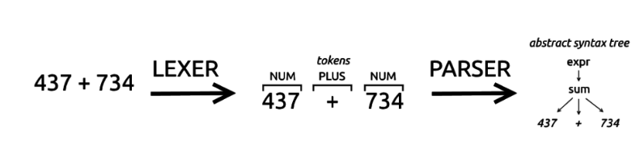

# ANTLR 

Narzędzie do tworzenia parserów
ANTLR to narzędzie służące do tworzenia kompilatorów oraz translatorów z opisu gramatyki zawierającego akcje w języku Java, C++, C# lub Python.

# Grammar for Python 3.8.1

https://docs.python.org/3/reference/grammar.html

# Struktura parsera

parser zazwyczaj jest zbudowant z dwóch części, lexer oraz właściwej części parsera.
Lexer skanuje strumień wejścia i tworzy odpowiadający mu token dla przykładu operacja 437+734 będzie wyglądać następująco

